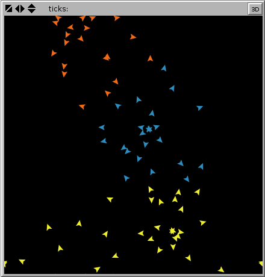

# NetLogo K-Means Extension

This extension is a thin wrapper around [Jung 2.0.1's k-means clusterer](http://jung.sourceforge.net/doc/api/edu/uci/ics/jung/algorithms/util/KMeansClusterer.html).

You can [download it from here](https://github.com/NetLogo/K-Means-Extension/releases/).

[K-Means clustering](http://en.wikipedia.org/wiki/K-means_clustering) is a method for partitioning data points into a specified number of clusters.

Historical note: k-means clustering used to be part of [the NetLogo NW extension](https://github.com/NetLogo/NW-Extension), but since k-means is not a network specific algorithm, it was moved to a separate extension.

## Usage

`k-means:cluster-by-xy` _turtles_ _number-of-clusters_ _max-number-of-iterations_ _convergence-threshold_

Clusters _turtles_ into the specified _number-of-clusters_ according to their positions in 2D space. The algorithm will stop when _max-number-of-iterations_ is reached, or when none of the centroids has moved as much as _convergence_threshold_ since the previous iteration.

Reports a list of agentsets, where each agentset represents a cluster.

#### Example:

The following code:

    extensions [ k-means ]

    to try-k-means
      clear-all
      ask n-of 3 patches [ sprout 25 [ fd random 10 ] ]
      let clusters k-means:cluster-by-xy turtles 3 100 0.1
      (foreach clusters (n-of 3 base-colors) [ ask ?1 [ set color ?2 ] ])
      show clusters
    end

May output:

    [(agentset, 20 turtles) (agentset, 31 turtles) (agentset, 24 turtles)]

And result in something like:

Keep in mind that k-means is a [randomized algorithm](http://en.wikipedia.org/wiki/Random_algorithm) and will not necessarilly give you the same result each time it runs.

## Building

Run `./sbt package` to build the extension.

If the build succeeds, `k-means.jar` will be created.

## Terms of Use

The NetLogo K-Means extension is in the public domain.  To the extent possible under law, Uri Wilensky has waived all copyright and related or neighboring rights.

[Jung](http://jung.sourceforge.net/) is licensed under the [BSD license](http://jung.sourceforge.net/license.txt).
